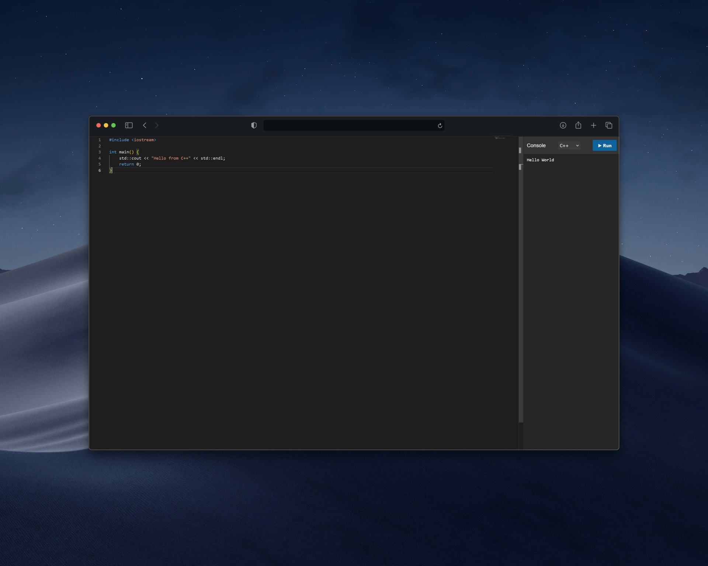

# ⚡ Distributed Collaborative IDE

A real-time, distributed code editor that allows users to write and execute code (Python/C++) simultaneously in isolated environments.

## 📖 Overview
This project is a full-stack distributed system designed to solve two complex engineering problems: **Real-time State Synchronization** and **Secure Remote Code Execution (RCE)**.

It features a "Google Docs" style collaboration experience where multiple users can edit code in the same room, combined with a high-performance backend that compiles and runs code in ephemeral, secure Docker containers.

## 🏗 Architecture
The system uses a **Hybrid Microservices Architecture**:
* **Coordinator Service (Node.js):** Handles WebSocket connections and manages room state.
* **Execution Service (Go):** A high-performance runner that spawns Docker containers.
* **State Store (Redis):** Persists code and room configurations to survive server restarts.

## 🚀 Key Features
* **Real-time Collaboration:** Users in the same "room" see code changes instantly (powered by Socket.io).
* **Remote Code Execution:** Securely runs untrusted code in ephemeral Docker containers.
* **Polyglot Support:** Supports **Python** (Interpreted) and **C++** (Compiled with GCC).
* **Smart Formatting:** Custom auto-indentation logic for C++ and Python using Monaco key-bindings.
* **Fault Tolerance:** Redis persistence ensures code is saved even if the server crashes.
* **Professional UI:** Resizable panes, dark mode, toast notifications, and connection status indicators.
* **Security Sandboxing:**
    * **Timeouts:** Hard limits on execution time (5s for Run, 10s for Compile) to prevent infinite loops.
    * **Resource Caps:** Containers limited to 128MB RAM and 0.5 CPUs.
    * **Network Isolation:** Containers have no internet access.

## 🛠️ Tech Stack
* **Frontend:** HTML5, Monaco Editor (VS Code Engine).
* **Coordinator:** Node.js, Express, Socket.io.
* **Executor:** Go (Golang), Docker SDK.
* **Database:** Redis (AOF Persistence).
* **DevOps:** Docker Compose.

## 📦 How to Run

### Prerequisites
* Docker Desktop (Running)
* Go 1.20+
* Node.js 18+

### Quick Start
1.  **Clone the repository**
    ~~~bash
    git clone https://github.com/alhusseinalahmed/collaborative-ide.git
    cd collaborative-ide
    ~~~

2.  **Start the System**
    We use a unified script to launch the Docker services (Redis + Node) and the Go Runner simultaneously.
    
    **Windows:**
    ~~~bash
    ./start-dev.bat
    ~~~
    
    **Mac/Linux:**
    ~~~bash
    chmod +x start-dev.sh
    ./start-dev.sh
    ~~~

3.  **Access the App**
    Open your browser to `http://localhost:3000`.
    * **Test Collaboration:** Open the link in a second tab
    * **Test Persistence:** Stop the server, restart it, and reload the page. Your code remains.

## 🧠 Engineering Decisions

### Why Go for the Execution Engine?
I chose Go for the runner service because of its native concurrency primitives (Goroutines). The system needs to manage potentially hundreds of concurrent Docker process lifecycles. Go's standard library `os/exec` and context management allow for precise control over process timeouts and cleanup, which is critical for preventing "zombie containers."

### Handling State with Redis
Initially, room state was stored in Node.js memory. This caused data loss during deployments. I introduced Redis to decouple state from the application logic. This allows the Node.js service to be stateless and horizontally scalable (ready for Kubernetes).

### The "Cold Start" Optimization
C++ compilation requires a heavy GCC image (~500MB). To prevent timeouts on the first run, the system uses a tiered timeout strategy: 10s for compilation tasks and 5s for standard execution. In a production environment, we would pre-warm these images on the worker nodes.

## 📸 Screenshots

